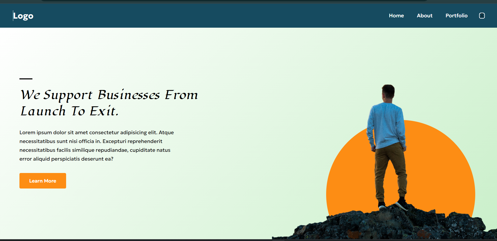

# HTML Exam Project


A single-page **business landing page** built with pure HTML5 and CSS3 for an HTML exam. The page introduces a business consultancy brand with the headline *"We Support Businesses From Launch To Exit"*, paired with a navigation bar, a call-to-action button, and a decorative hero illustration.

---

## ✨ Features

- **Navigation bar** with a logo, three nav links (Home, About, Portfolio), and a user icon
- **Hero section** with a small decorative accent line, a bold heading, descriptive paragraph text, and a "Learn More" call-to-action button
- **Custom typography** using two imported fonts — a cursive display font for the heading and a variable sans-serif font for body text
- **Decorative circle shape** layered behind the hero illustration
- **Hover effects** on navigation links and the CTA button
- **Custom fonts** loaded locally via `@font-face`

---

## 🛠️ Technologies Used

- **HTML5** – Semantic page structure
- **CSS3** – Styling, layout (Flexbox), positioning, and hover effects
- **Assets/Images & Fonts** – Custom fonts and illustration images used throughout the page

---

## 📂 Project Structure

```
HTML-Exam/
├── index.html
├── style.css
├── assets/
│   ├── fonts/
│   │   ├── Lugrasimo-Regular.ttf
│   │   └── Geologica-Variable.ttf
│   ├── user.png
│   └── men.png
└── README.md
```

---

## 🚀 How to Run

1. **Download or clone** the repository:
   ```bash
   git clone https://github.com/dhyeykakadiya71-dotcom/html-exam.git
   ```
2. **Open the project folder** on your computer.
3. **Open `index.html`** directly in any modern web browser (Chrome, Edge, Firefox, etc.).

No server, build tools, or installation are required — this is a static HTML/CSS webpage that runs entirely in the browser.

---

## 🎨 Design

- **Layout:** Built with **Flexbox**, splitting the hero section into a left content column and a right image column
- **Typography:** Uses two custom fonts — `Lugrasimo` for the main heading (cursive style) and `Geologica` for body text and UI elements
- **Navigation:** A fixed-style top navbar with a dark background, logo, and horizontal nav links
- **Buttons:** A styled "Learn More" call-to-action button with a color-changing hover effect
- **Shapes:** A large decorative circle positioned behind the hero illustration for visual depth
- **Images:** A hero illustration image and a small user icon in the navbar
- **Background:** A soft diagonal gradient background in the hero section
- **Responsiveness:** The layout currently uses a fixed minimum width and is designed primarily for desktop screens

---

## 📁 Assets

The `assets/` folder contains the resources used by the webpage, including the custom font files (`Lugrasimo` and `Geologica`) and the images used in the navbar and hero section (user icon and hero illustration).

---

## 📸 Preview



---

## 📚 What I Learned

- Structuring a webpage using semantic HTML5 elements (`header`, `nav`, `section`)
- Styling with CSS3, including colors, spacing, and typography
- Using **Flexbox** for layout alignment and positioning
- Working with **absolute and relative positioning** to layer decorative elements
- Importing and applying **custom fonts** using `@font-face`
- Adding **hover effects** and interactive states with CSS
- Using **images and assets** effectively within a webpage
- Building a simple **navigation bar** with links

---

## 🔮 Future Improvements

> The following are potential future improvements and are **not** part of the current project:

- Improve responsiveness for tablet and mobile screens
- Enhance accessibility (alt text, keyboard navigation, ARIA labels)
- Add additional pages (About, Portfolio) with real content
- Introduce JavaScript for interactivity (mobile menu, animations)
- Add smoother CSS transitions and animations

---

## 👨‍💻 Author

**Dhyey Kakadiya**
GitHub: [dhyeykakadiya71-dotcom/html-exam](https://github.com/dhyeykakadiya71-dotcom/html-exam)

---

## 📄 License

This project is licensed under the **MIT License** — feel free to use, modify, and distribute it with attribution.
